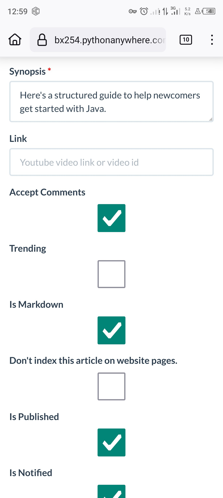
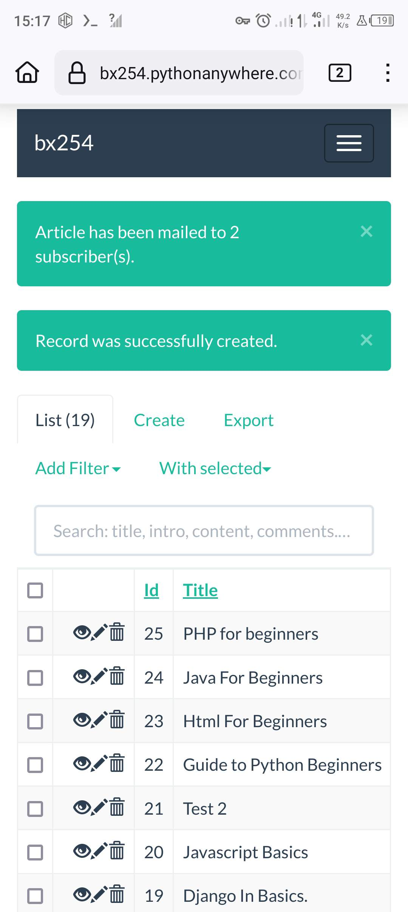

<h1 align='center'>Youtube-Blog </h1> 

<p align="center">
 </img>
</p>

<p align="center"><a href="https://github.com/Simatwa/Youtube-Blog"></a>
<a href="#"></a>
<a href="https://wakatime.com/badge/github/Simatwa/Youtube-Blog"></a>
<a href="https://hits.seeyoufarm.com"></a>
<a href="#"></a>
</p>

<p align='center'>A blogging site optimized for YouTubers.</p>

<h2 align="center">1. Users End</h2>

| Collection 1 | Collection 2 | Collection 3 | Collection 4 |
|--------------|--------------|--------------|--------------|
|     |     |     |     |
|     |     |     |     |
|     |     |     |     |
|     |
|     |     |     |     |


<h2 align="center">2. Admin </h2>

| Collection 1 | Collection 2 | Collection 3 | Collection 4 |
|--------------|--------------|--------------|--------------|
|     |     |     |     |
|     |     |     |     |
|     |     |     |     |
|     |     |     |     |

This platform provides a mobile-friendly interface and offers various features to enhance your blogging experience. With Youtube-Blog, you can easily manage your content, convert Markdown to HTML, integrate ads, and engage with your audience through comments and likes.

## Features
- Mobile friendly: Enjoy a seamless browsing experience on mobile devices.
- Admin endpoint: Easily manage your content through the admin endpoint.
- File Management endpoint: Efficiently handle file management tasks.
- Markdown to HTML conversion: Convert your Markdown content to HTML for a visually appealing presentation.
- Content's subscription: Allow users to subscribe to your content for regular updates.
- Mail subscribers: Communicate with your subscribers at the convenience of your admin panel.
- Ads integration support: Monetize your blog by integrating ads into your articles.
- Auto SEO: Optimize your blog for search engines automatically.
- Comment Section: Engage with your audience through a comment section for each article.
- Views count per article: Keep track of the number of views each article receives.
- Likes count per article: Enable users to show their appreciation by liking your articles.

Other minor features include:

- Auto-generate Audio & Video HTML tags: Easily embed audio and video content in your articles.
- Live Article Search: Quickly find articles using the search functionality.
- Social Media Integration: Share your articles on various social media platforms.
- M-M Category-Blog relation: Categorize your articles for easy navigation.
- Auto-rank trending blogs: Highlight trending blogs to attract more readers.

## Technologies used

Youtube-Blog is built using the following technologies:

- W3CS: CSS Framework by w3schools.
- W3JS: Javascript framework by w3schools.
- HTML: Markup language for creating web pages.
- FLASK: Python-based web framework for building web applications.

## Installation and Usage

### Installation

To install Youtube-Blog, make sure you have Python 3.8 or higher installed on your system. Then, follow these steps:

1. Clone the repository:

```
git clone https://github.com/Simatwa/Youtube-Blog.git
cd Youtube-Blog
```

2. Install the required dependencies:

```
pip install -r requirements.txt
```

### Usage

Before running the site, you need to set up the environment variables. Edit the [env](env) file according to your preferences and rename it to *.env*.

To set up an admin account for content management, run the following command:

```
flask user create-admin
```

Follow the prompts to create the admin account. Once done, start the server by running:

```
flask run
```

You can access the site at `http://localhost:5000`, and the admin endpoint at `http://localhost:5000/admin`.

## Further info

To insert audio or video in an article, use the format `%(file_n)s`, where **n** is the file number at upload.

To append a path to an image or any other file (excluding video and audio), use the format `%(category_n)s`, where **category** can be either *file* or *image*, and **n** is the media position at upload.

To insert ads into an article, use the tag `{ads}` anywhere within the article. You can use the tag multiple times to display multiple ads.

> **Note:** Script-based tags are rendered immediately before the `</body>` tag and not within the `{ads}` tag like non-script ads code.

## Usage Tips

1. An article without a cover photo, default one will be used.
2. For long titled articles, consider using a `large` cover photo so as to avoid squeezing up
3. Remember to include `<figcaption>{Figure Caption}</figcaption>` in your images. *Not mandatory though*
4. Remember if a Youtube link video is available, the video will be displayed instead of cover photo at timeline and as last entry on article page.
5. Sometimes the `%(image_n)s` may fail to be functional. So counter check before publishing articles. *To be fixed soon*
7. You can customize admin theme using the [Bootswatch](https://bootswatch.com/) themes by modifying the `FLASK_ADMIN_SWATCH` at your [env](env) file. Popular themes include : cerulean, flatly, spacelab, cosmo, journal, united, sandstone, yeti and lumen.
8. For non-mobile devices, just **scale** down the window size to acccess the site contents.
9. Remember to set a **new screte key** for every web-app.

## Disclaimer

- Youtube-Blog is a micro-blog site and may be vulnerable to certain attacks. The developer(s) of this site will not be liable for any loss or illegal concerns arising from the commercial or personal use of this site.

## Conclusion

- For hosting I recommend using [pythonanywhere](https://pythonanywhere.com) since they feature a free plan with lots of goodies such as free ssl certificates and zero lifetime hosting charges!
- If you are a blogger looking to monetize your site through ads, I recommend using [Adsterra](https://adsterra.com).

- Contributions are always welcome. Help me fix my bad code by submitting a [pull request](https://github.com/Simatwa/Youtube-Blog/pulls) or you can as well submit an [issue](https://github.com/Simatwa/Youtube-Blog/issues).

>**Note** By the way I have my site up and running using this codebase check it out [here](https://bx254.pythonanywhere.com).

## AOB

This is my first `big` Flask project and it was fun creating it using the tools I had access to in my **Android Phone** i.e [*Pydroid 3*](https://play.google.com/store/apps/details?id=ru.iiec.pydroid3&hl=en_US) IDE to write this kind of stuff along with [*Termux*](https://f-droid.org/packages/com.termux/) to ensure it reaches you here on Github. 

<center>

**Dedication**

</center>

I'm delighted to dedicate this work to my loving **mom** Sarah, who ensured I have sufficient time in creating this during my long holiday and my understanding girlfriend **Eunice**, for entertaining my late replies and picking-up my late-night calls as well.


<p align="center">Made with ❤️ </p>
